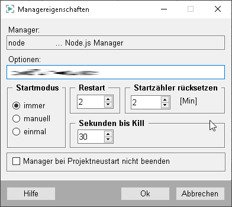
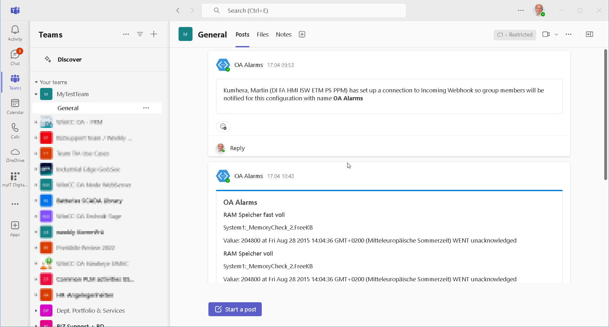

# WinCC OA Alarm messages to Team
For the setup of the WinCC OA messenger, you will need following prerequisites:
* Setup your MS Teams _Team_ and add an incoming WebHook

* WinCC OA V3.20
* nodejs V18++
## Add an incoming webHook to your Team
* Click "..." at your Team

* Click "Manage Team"

* Click "Add App"

* Add "Incoming WebHook" App

* Choose "Add to a Team"

* Select "Connection einrichten"

* Choose a name which will be used to identify all messages communicated via this hook and select "Einrichten"

* Teams will generate a unique URL for your WebHook.
* Copy the Link and add it in the source file for your url variable.
* Then finish the configuration

## Setup your NodeJS Project
* Copy this project in a directory of your choice - ideally in your WinCC OA Project/javascript directory.
Add the created WebHook URL in the code of index.js (url=...)

Execute "npm install" in your project directory to get all required packages

## Configure your WinCC OA Project
* Start the WinCC OA console

* Add a new "node" manager in your project console and provide the to the index.js file in this NodeJS project (relative to directoy javascript).

## Finaly
* Start your project and you should see, that the node manager is correctly starting and running.
And you should receive a new message in your MS Teams Team.

## Additional
* Now you can start to modify your application.
* At first you might change the select statement in the dpQueryConnectSingle call to change the set of alarms you want to receive and/or the information you want to receive.